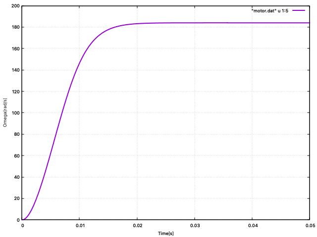
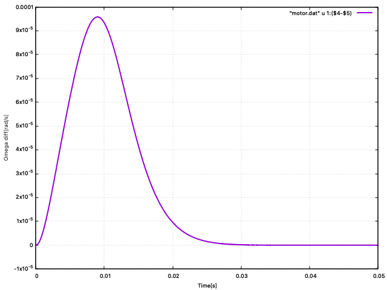

# Motor simulation
モータでプロペラを回すシミュレーションをオイラー法とルンゲ・クッタ法でやってみました。

## モータの方程式

### 電気系の方程式
$$
L_m \frac{di}{dt} + R_m i + K_m \omega = u
$$

### 機械系の方程式
$$
J_m \frac{d \omega}{dt} + D_m \omega + T_L = K_m i 
$$

### プロペラのトルク負荷
$$
T_L = C_q \omega^3
$$


## 計算諸元
想定するモータとプロペラの各種諸元は以下の通り
表を作るのが面倒だったのでソースから抜粋
```
const double Lm = 3.7e-4;//Inductance[H]
const double Rm = 1.2e-1;//Resistance[Ohm]
const double Km = 3.3e-3;//Torque constant[Nm/A]
const double Jm = 8.1e-6;//Moment of inertia[kg m^2]
const double Cq = 3.0e-8;//Cofficient of torque (Propeller)
const double Dm = 0.0;   //Cofficient of viscous damping [Nm s]
const double End_time = 0.05;//Time [s]
```


## ルンゲ・クッタの計算結果


オイラー法の計算結果と重ねようと思いましたが、ほとんど見分けがつかなかったのでやめました。

## ルンゲ・クッタ法とオイラー法との差


僅かながら、両者には差があり、ルンゲ・クッタ法に対してオイラー法がどの程度違いがあるかみてみました。
モータの速度が収束すると両者の差は無くなると言う結果です。

## プログラムで工夫した点
オイラーやルンゲ・クッタのソルバー関数は任意の微分係数を計算する関数を関数（導関数の関数）のポインタとして呼び出せるようになっています。
その際に、導関数の関数は計算に必要なパラメータの数が違うため、可変長引数を実現できるように工夫しました。
